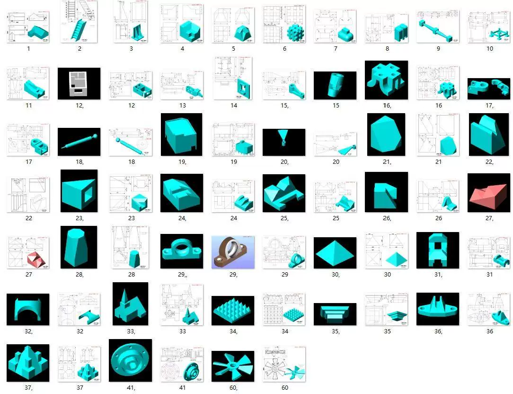
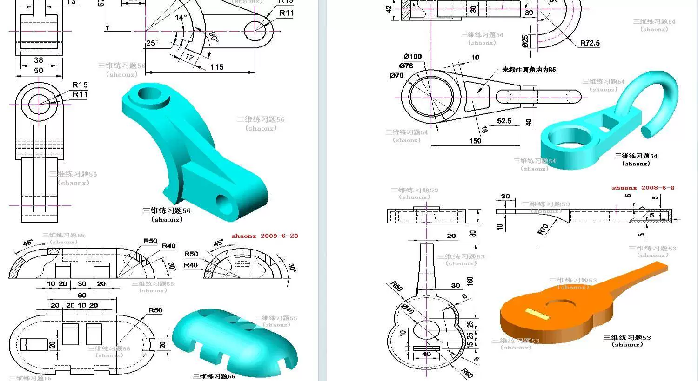
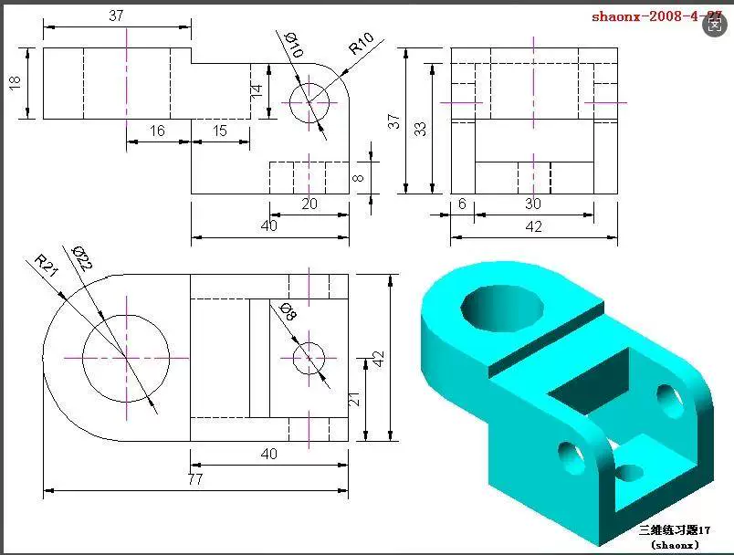
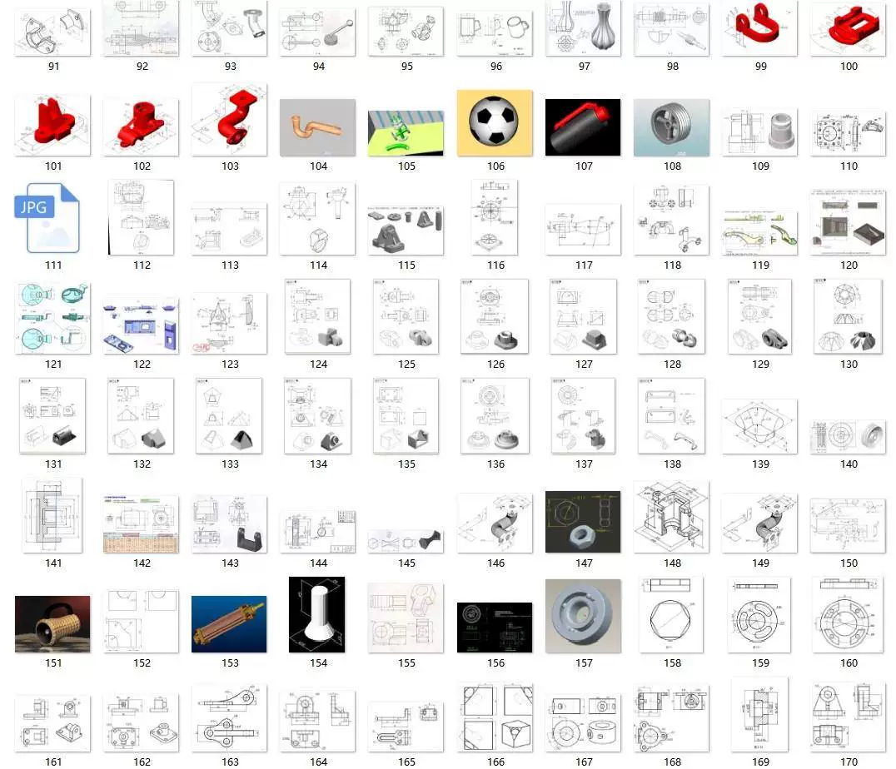
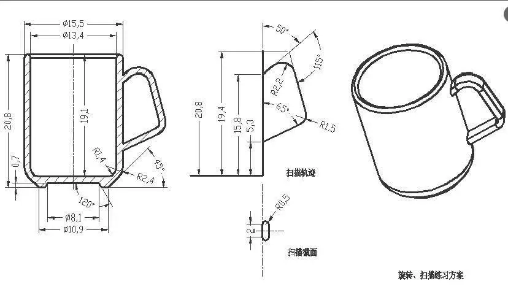
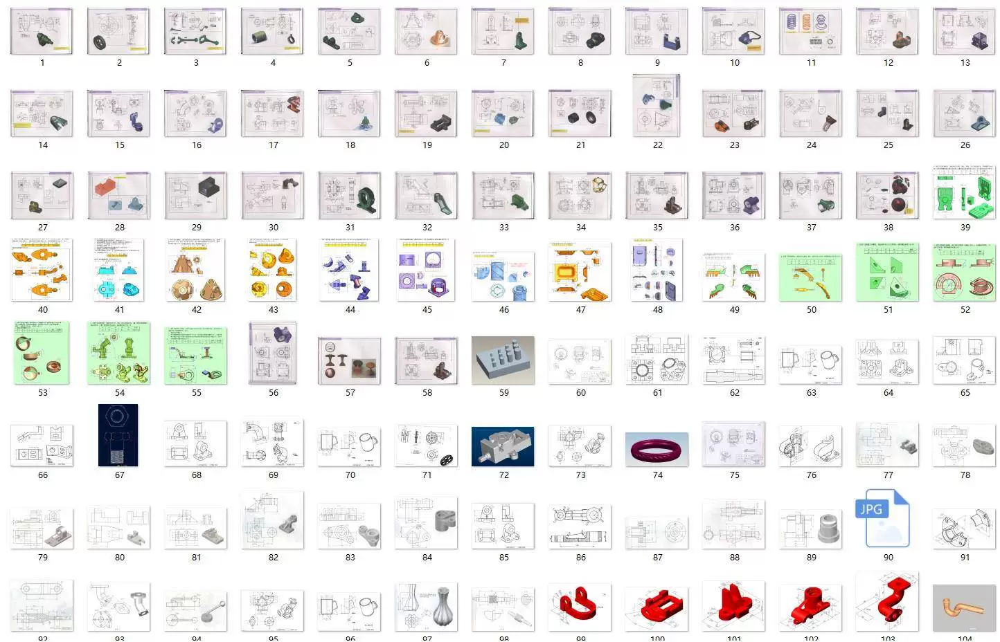
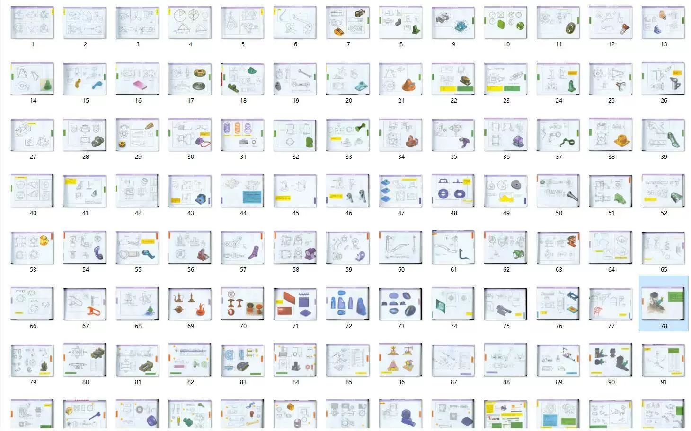

# 3000 sets of mechanical CAD/SW/UG/Proe three-dimensional modeling drawings for beginners

## Body

3000 sets of mechanical CAD/SW/UG/Proe 3D modeling drawings for beginners in part drawing practice material.

3000 sets of CAD/SW/UG/Proe 3D modeling drawings for beginners, complete with parts drawing practice materials.

Payment Successful, Auto-shipment

- Suitable for CAD (DWG), SolidWorks (SLDPRT), UG (PRT), Pro/E and other drawing personnel.

- Level of difficulty in the drawings (Beginner/Intermediate/Advanced), suitable for different learning stages

**Applicable Audience:** 
? Students majoring in Mechanical Design/Manufacturing 
? Learners of CAD/SW/UG/Proe software 
? Skill enhancement for mechanical engineers 
? Candidates preparing for drawing certification

## Images

## Payment

Here is a pay link on Stripe ( https://buy.stripe.com/3cs8yP7sY87d0vu9AB ). Please contact me lonlonago@foxmail.com after funding $89, and I will send you a complete data files , thank you!

